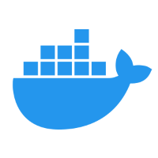

# Linux Lab : 學習更多開發技巧
## 起源
<span style="font-size: 20px;">台灣國立宜蘭大學  
資訊工程學系 RFID 實驗室  
🎓 2024 畢業專題 - **[k12edu Github 組織](https://github.com/k12edu)**  </span>

## 基礎開發技術教學(附影片)
| <span style="font-size: 24px;">示意圖</span> | <span style="font-size: 24px;">連結</span> |
|:----:|:----:|
|  | <span style="font-size: 20px;">[基礎 VScode/Git/Github 操作]()</span> |
|  | <span style="font-size: 20px;">[免費資源介紹 - Google Colab, Github CodeSpace]()</span> |
|  | <span style="font-size: 20px;">[不同 Linux 發行版介紹]()</span> |
|  | <span style="font-size: 20px;">[Virtualbox(虛擬機軟體) 與 Linux 虛擬機]()</span> |
|  | <span style="font-size: 20px;">[SSH 遠端開發]()</span> |
|  | <span style="font-size: 20px;">[Linux Docker 安裝與操作]()</span> |

## 中階開發技術教學(附影片)
| 示意圖 | 連結 |
|:----:|:----:|
|  | <span style="font-size: 20px;">[Docker Compose 容器群設定]()</span> |
|  | <span style="font-size: 20px;">[Docker Hub 鏡像保存]()</span> |
|  | <span style="font-size: 20px;">[Proxmox VE 虛擬化平台]()</span> |

## 進階開發技術教學(附影片)
| 示意圖 | 連結 |
|:----:|:----:|
|  | <span style="font-size: 20px;">[CI/CD 持續性提交與自動化部屬]()</span> |
|  | <span style="font-size: 20px;">[Github Actions 自動化流程]()</span> |
|  | <span style="font-size: 20px;">[Kubernetes 伺服器架構]()</span> |

## 測試複製
```bash
sudo apt update
```