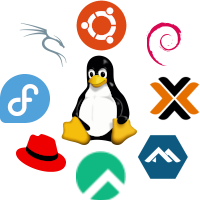
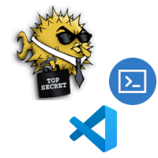

# Linux Lab: Learn More Development Skills
## Origin
National Ilan University, Taiwan  
Department of Computer Science and Information Engineering, RFID Laboratory  
🎓 2024 Graduation Project - [k12edu Github Organization](https://github.com/k12edu)  

## Basic Linux Tutorials (Including Youtube Videos)
| Example Image | Link |
|:----:|:----:|
|  | [Basic VScode/Git/Github Operations]() |
|  | [Introduction to Free Resources - Google Colab, Github CodeSpace]() |
|  | [Introduction to Different Linux Distributions]() |
|  | [Virtualbox (Virtual Machine Software) and Linux Virtual Machines]() |
|  | [SSH Remote Development]() |
|  | [Linux Docker Installation and Operations]() |

## Advanced Linux Tutorials (Including Youtube Videos)
| Example Image | Link |
|:----:|:----:|
|  | [Proxmox VE Virtualization Platform]() |
|  | [Docker Compose Container Cluster Setup]() |

## Using Open Source Tools or Free Resources
- [Web Framework](https://github.com/docsifyjs/docsify)
- [Some Images on the Website](./_media/source.md)
