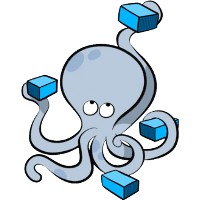

# Linux Lab:學習更多開發技巧
## 起源
台灣國立宜蘭大學  
資訊工程學系 RFID 實驗室  
🎓 2024 畢業專題 - [k12edu Github 組織](https://github.com/k12edu)  

## Linux 基礎教學文檔(附 Youtube 影片)
| 示意圖 | 連結 |
|:----:|:----:|
|  | [基礎 VScode/Git/Github 操作]() |
|  | [免費資源介紹 - Google Colab, Github CodeSpace]() |
|  | [不同 Linux 發行版介紹]() |
|  | [Virtualbox(虛擬機軟體) 與 Linux 虛擬機]() |
|  | [SSH 遠端開發]() |
|  | [Linux Docker 安裝與操作]() |

## Linux 進階教學文檔(附 Youtube 影片)
| 示意圖 | 連結 |
|:----:|:----:|
|  | [Proxmox VE 虛擬化平台]() |
|  | [Docker Compose 容器群設定]() |

## 使用開源工具或免費資源
- [網頁框架](https://github.com/docsifyjs/docsify)
- [網頁中部份圖片](./_media/source.md)